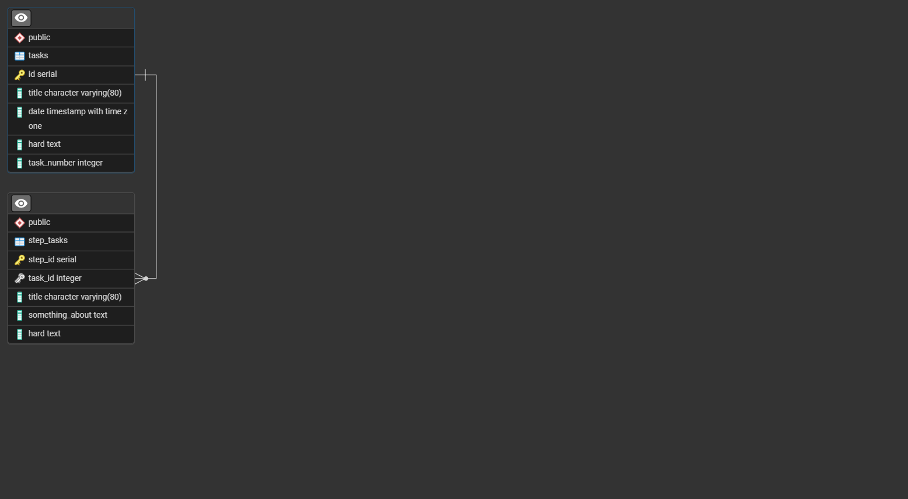
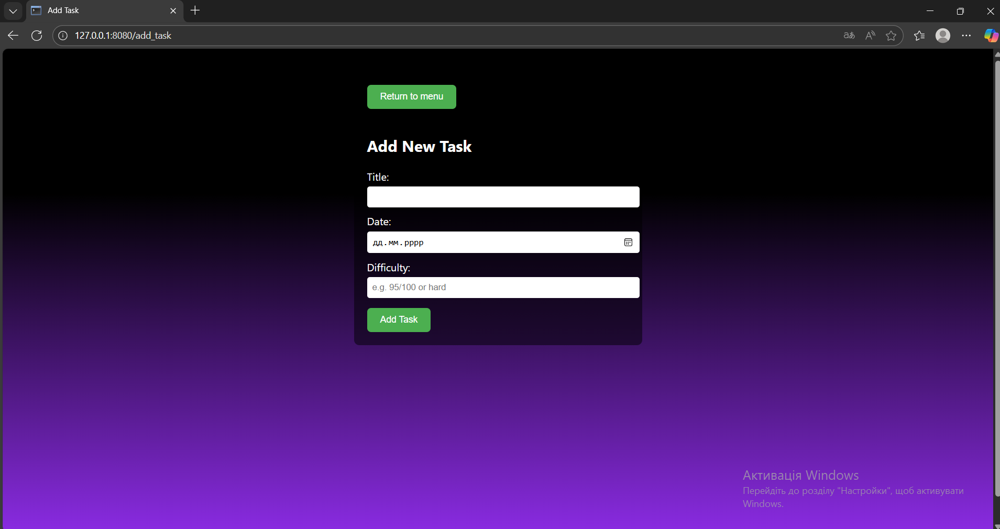
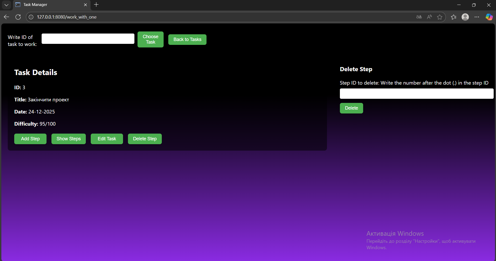
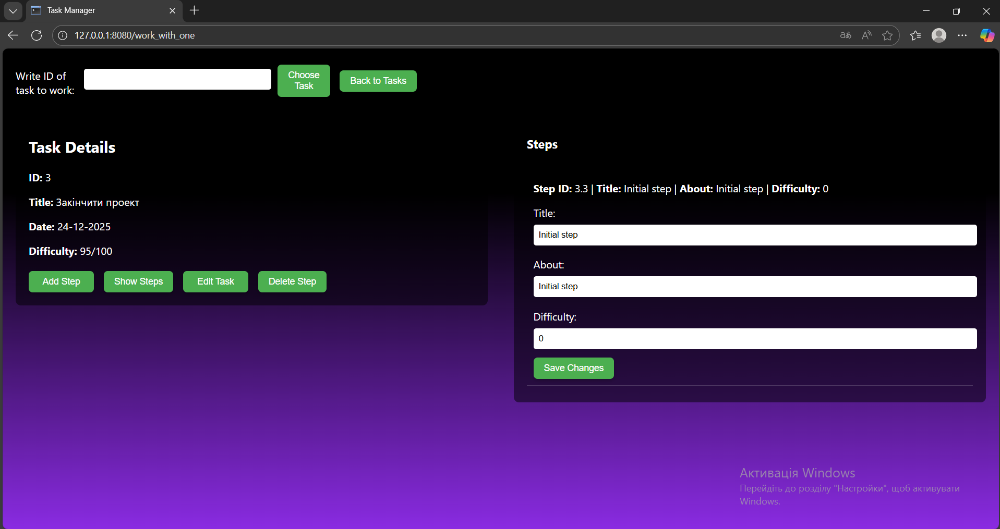

# Task Manager (Flask + PostgreSQL)

Цей проєкт є міні-застосунком Task Manager, реалізованим із використанням фреймворку Flask та системи керування базами даних PostgreSQL. Застосунок призначений для керування завданнями (Tasks) та пунктами їх виконання (Steps), які логічно пов’язані між собою зв’язком one-to-many. У проєкті реалізовано повний CRUD-функціонал для обох сутностей, зокрема створення, перегляд списку, перегляд одного об’єкта, редагування та видалення. Інтерфейс побудований на HTML-шаблонах із використанням Jinja2 та має стриманий дизайн із напівпрозорими блоками.

Застосунок підтримує додавання, перегляд, редагування та видалення завдань, а також роботу з кроками виконання (steps), які належать конкретному завданню. Передбачено перегляд списку кроків для кожного завдання, автоматичне керування пов’язаними даними, обробку помилок та перевірку коректності введених користувачем даних.

База даних складається з двох основних таблиць. Таблиця `Tasks` містить поля: `id` (первинний ключ), `title` (назва завдання), `date` (дата виконання) та `hard` (складність завдання). Таблиця `Step_tasks` містить поля: `id` (первинний ключ), `task_id` (зовнішній ключ на `Tasks.id`), `title` (назва кроку), `something_about` (опис) та `hard` (складність кроку). Між таблицями реалізовано зв’язок one-to-many, тобто одне завдання може містити кілька кроків виконання.

Схема бази даних представлена нижче:

Застосунок реалізований на Flask із використанням маршрутів (`@app.route`) для виконання CRUD-операцій. Дані з HTML-форм обробляються через `request.form`, а відображення інформації здійснюється за допомогою шаблонів Jinja2. Робота з базою даних PostgreSQL реалізована через бібліотеку `psycopg2`. Параметри підключення до БД (ім’я бази, користувач, пароль, хост і порт) описані у функції `get_db()` у файлі `main.py`.

У проєкті використано транзакції PostgreSQL для виконання кількох взаємопов’язаних операцій в одному логічному блоці. Наприклад, під час створення нового завдання одночасно додається запис у таблицю `Tasks` та початковий крок у таблицю `Step_tasks`. Обидві операції виконуються в межах однієї транзакції, і у разі виникнення помилки всі зміни скасовуються за допомогою `rollback`.

Також у базі даних реалізовано тригер PostgreSQL, який автоматично виконує допоміжну логіку, зокрема підрахунок або оновлення агрегованих даних, таких як кількість завдань. Це дозволяє перенести частину бізнес-логіки безпосередньо на рівень бази даних, зменшити навантаження на Flask-застосунок та забезпечити цілісність даних.

Нижче наведено скріншоти застосунку, які демонструють основний функціонал:

Початкова сторінка  

Список завдань  

Робота з одним завданням  

Додавання завдання  

Зміна інформації про завдання  

Видалення завдання  

Додавання пункту до завдання  

Видалення пункту до завдання  

Зміна інформації щодо пункту до завдання  

Список пунктів до завдання  

Для запуску проєкту необхідно скопіювати його у будь-яку директорію, перейти в цю директорію через термінал, запустити сервер PostgreSQL та вказати параметри підключення до бази даних у файлі `main.py` у функції `get_db()`. Після цього потрібно ініціалізувати Flask-застосунок, виконавши команду `$env:FLASK_APP="main.py"`, а далі створити таблиці за допомогою команди `flask init_db`. Після ініціалізації застосунок можна запускати стандартною командою `flask run`, після чого він буде доступний у браузері за локальною адресою.
